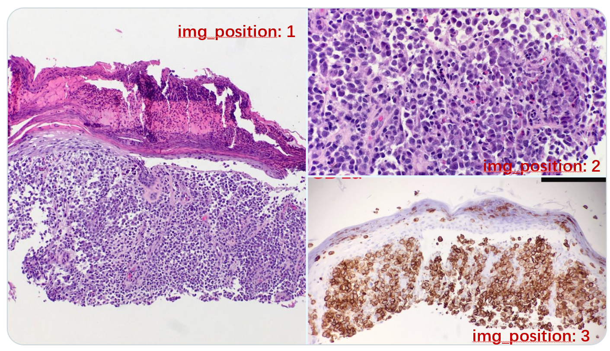

# PathMMU Additional Data Acquisition Instructions

After you apply for Hugging Face's data, these steps are required to download the part of the images from the official website to complete the full dataset. 

## PathCLS Subset


1. The PathCLS subset contains data sampled from widely recognized pathology classification datasets, including PatchCamelyon, CRC-100K, SICAPv2, BACH, Osteo, SkinCancer, MHIST, WSSS4LUAD, and LC25000. Below we provide the official website of each dataset, download it and find the corresponding data according to the path of the image we gave.

   1. **PatchCamelyon17**: have been given in `images`, no additional actions are required.

      <!-- Reference: Rotation equivariant cnns for digital pathology. -->

   2. **CRC-100K**: https://zenodo.org/records/1214456, download **NCT-CRC-HE-100K.zip**

      <!-- Reference: 100,000 histological images of human colorectal cancer and healthy tissue. -->

   3. **SICAPv2**: https://data.mendeley.com/datasets/9xxm58dvs3/1

      <!-- Reference: Going deeper through the Gleason scoring scale: An automatic end-to-end system for histology prostate grading and cribriform pattern detection. -->

   4. **BACH**: https://iciar2018-challenge.grand-challenge.org/Dataset/

      <!-- Reference: BACH: Grand challenge on breast cancer histology images. -->

   5. **Osteo**: https://journals.plos.org/plosone/article?id=10.1371/journal.pone.0210706

      <!-- Reference: Viable and necrotic tumor assessment from whole slide images of osteosarcoma using machine-learning and deep-learning models. -->

   6. **SkinCancer**: https://heidata.uni-heidelberg.de/dataset.xhtml?persistentId=doi:10.11588/data/7QCR8S

      <!-- Reference: Deep learning for the detection of anatomical tissue structures and neoplasms of the skin on scanned histopathological tissue sections. -->

   7. **MHIST**: https://bmirds.github.io/MHIST

      <!-- Reference: A Petri Dish for Histopathology Image Analysis. -->

   8. **WSSS4LUAD**: https://wsss4luad.grand-challenge.org/

      <!-- Reference: WSSS4LUAD: Grand Challenge on Weakly-supervised Tissue Semantic Segmentation for Lung Adenocarcinoma. -->

   9. **LC25000 (LC-Lung and LC-Colon)**: https://github.com/tampapath/lung_colon_image_set?tab=readme-ov-file

      <!-- Reference: Lung and Colon Cancer Histopathological Image Dataset (LC25000). -->

The dataset is organized according to the following structure. Each image can be found according to the source_img field in the JSON file.

```
/path/to/your/directory/
│
├── BACH/
│   └── images/
├── CRC100K/
│   └── NCT-CRC-HE-100K/
│       ├── ADI/
│        ...
│       └── TUM/
├── LC25000/
│   ├── colon_aca/
│   ├── colon_n/
│   ├── lung_aca/
│   ├── lung_n/
│   └── lung_scc/
├── MHIST/
│   └── images/    
├── Osteo/
│   ├── Training-Set-1/
│   └── Training-Set-2/
├── SICAPv2/
│   └── images/
├── SkinCancer/
│   └── data/
│       └── tiles/
└── WSSSLUAD/
    ├── 1.training/
    ├── 2.validation/
    └── 3.testing/
```

Then you can use the provide code `construct_pathcls.py` to directly  place them in the `images` folder.


## SocialPath Subset



```json
    {
      "No": 1,
      "img": "9e48f82c8b7e8b3ad24cf8dd158e8635aa6d48d7e3b9c299012f43da6e72019b.jpg",
      "question": "Based on the cellular morphology, what characteristic feature can be observed in numerous cells within this high-power field?",
      "options": [
        "A) Bi-lobed nuclei with eosinophilic granules",
        "B) Macronucleoli",
        "C) Cytoplasmic vacuolation",
        "D) Multi-lobed nuclei"
      ],
      "answer": "A) Bi-lobed nuclei with eosinophilic granules",
      "explanation": "The cells with bi-lobed nuclei and brightly eosinophilic (red-staining) cytoplasmic granules are indicative of eosinophils, which are interspersed throughout the field evident in the image.",
      "tw_id": "1045452664673316865",
      "img_position": 2,
      "ref_web": "https://x.com/abc/status/1045452664673316865"
    }
```

In the SocialPath subset's JSON file (`socialpath_mapping.json`), we provide the **Twitter ID (`tw_id`)**. Since some Twitter posts contain multiple images, the specific image's location is indicated in the **`img_position` field**. You can use this information with the Twitter API to download the images.  Additionally, you can use `ref_web` to directly log into the website and visually inspect the images. 

After downloading the images, please place them in the `images` folder.


## Atlas Subset

Many of the data in our atlas originate from our internal doctors' training guidelines. We sincerely apologize, as we are unable to make these guidelines open source. To ensure the integrity of **PathMMU**, we have used [**ARCH**](https://arxiv.org/abs/2103.05121) as an alternative data source, which is also derived from various atlases and books.

> #### Accessing the Data

We employed a completely consistent pipeline, which includes strict data cleaning and human evaluation for each sample, to guarantee the quality and authority of the data. Additionally, to maintain consistency, we ensured that the test and validation sets contain an equal number of questions, with a slightly higher number of images.

We provide the source images for your use. You can download the `book_set` data from the following link:

[Download book_set Data](https://warwick.ac.uk/fac/cross_fac/tia/data/arch)

After downloading, please use the images from the dataset according to the `source_img` reference provided in each data sample.


> #### Example Data Entry

```json
{
  "No": 0,
  "img": "d6deb3d90223531e7317153e8c720bf116e4678e181a19eb023987d5d2038529.png",
  "question": "What feature is significantly absent in the uppermost layers of the epithelium?",
  "options": [
    "A) Hyperkeratosis",
    "B) Parakeratosis",
    "C) Ballooning degeneration",
    "D) Both A and B"
  ],
  "answer": "D) Both A and B",
  "explanation": "The image lacks significant hyperkeratosis and parakeratosis, findings that are noted as absent in the description of the epithelial layer.",
  "source_img": "books_set/images/5759734a-71c3-4769-a668-afb4a454c89c.png"
}
```

If you wish to use any part of this Atlas data, you **must** cite the following work:

```bibtex
@inproceedings{gamper2020multiple,
  title={Multiple Instance Captioning: Learning Representations from Histopathology Textbooks and Articles},
  author={Gamper, Jevgenij and Rajpoot, Nasir},
  booktitle={Proceedings of the IEEE Conference on Computer Vision and Pattern Recognition},
  year={2021}
}
```